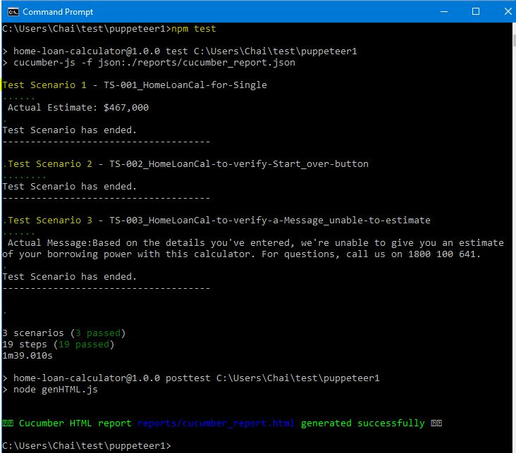
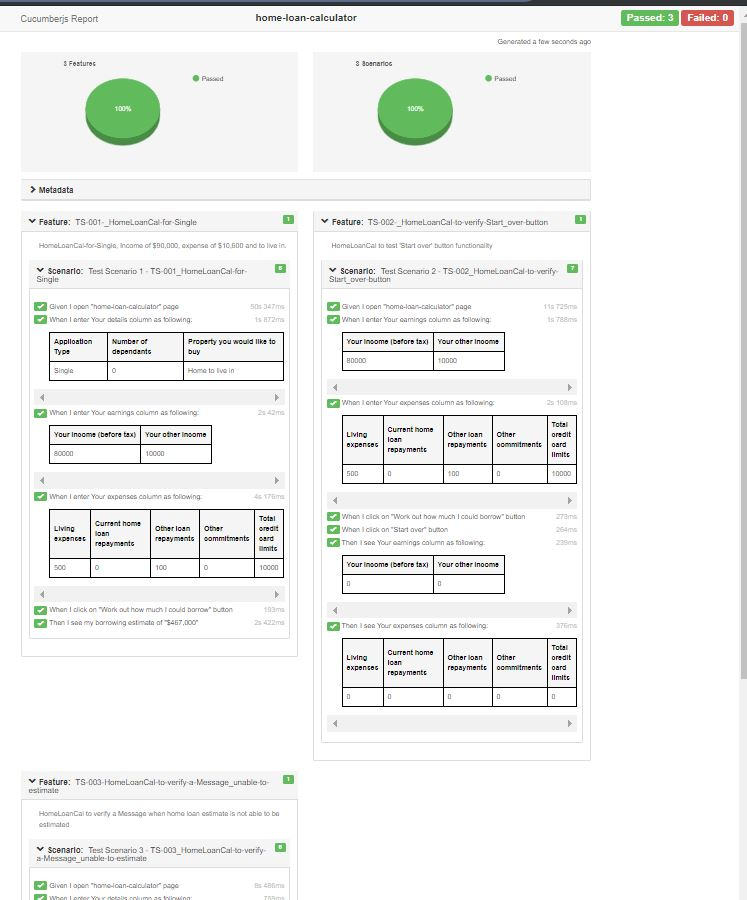

# **Front End Testing Scenario**
Test Framework Example in Javascript using Puppeteer and Cucumber-Js.


#   Table of Contents

* [Overview and technologies used](#overview)
* [How to setup](@howtosetup)
* [How to run tests and generate JSON and HTML files](#howtoruntests)
* [Where to find HTML Report](#htmlreport)
* [Examples of Test Execution and HTML report](#outputexamples)
* [Jenkins (CI/CD) Integration guideline](#jenkins)
* [Potential Improvements](#potentialimprovements)

<a name="overview"></a>
## 1. Overview and dependencies used

Dependencies and versions used (as in package.json)
* "puppeteer": "^1.20.0"
* "cucumber": "^5.1.0"
* "cucumber-html-reporter": "^5.0.2"

Browser type: Chromium (default with Puppeteer)

<a name="howtosetup"></a>
## 2. How to setup
___

Pull (clone) souce code from Git and install 'node.js packages' as below commands: 

```javascript
git clone git@github.com:pichai-t/homeloancal-puppeteer.git
npm i
```

> Note: Git client and node.js are required to run above commands
> * [Git Installation](https://www.atlassian.com/git/tutorials/install-git)
> * [Node.Js Installation](https://nodejs.org/en/download/) 
--- 

<a name="howtoruntests"></a>

## 3. How to run tests and generate JSON and HTML files

Run CLI "<code>npm test</code>" to execute tests 
```commandline
npm test
```
> Note: Basically, features files under ./features folder will be picked up and run


Then these two scripts (test and posttest) will be executed respectively as stated in "package.json":
```json
"scripts": {
    "test": "cucumber-js -f json:./reports/cucumber_report.json",
    "posttest": "node genHTML.js"
},    
```

Once finished, there will be two reports 'cucumber_report.json' and 'cucumber_report.html' under ./reports folder.   

> Note: JSON file will be produced every time "test" step finished and this JSON file (./reports/cucumber_report.json) will be required for "posttest" step to generation of HTML
---

<a name="htmlreport"></a>
## 4. Where to find HTML Report

HTML report can be found under ./reports folder as "cucumer_report.html".
---
<a name="jenkins"></a>
## 5. Jenkins (CI/CD) Integration guideline
In your new Jenkins Job:
1. Under Git Integration: pull souce code from github (git@github.com:pichai-t/homeloancal-puppeteer.git)
2. Add step: to Run "<code>npm i</code>"
3. Add step: to run "<code>npm test</code>"
4. If needed, HTML report can be used for further integration (such as other integrations; such as Jira, qTest. file"cucumer_report.html" under ./reports folder.

---
<a name="outputexamples"></a>
## 5. Examples of Test Execution and HTML report





<a name="potentialimprovements"></a>
## 6. Potential Improvements

* Page Object Model implementation
* Multi Browsers support (such as firefox (beta) or Chrome, Edge (coming), or mobile)
* Test parallel (maybe to use npm: puppeteeer-cluster)

--- 
